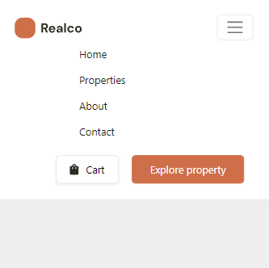

# House
Одностраничник адаптируемый на разные разрешения экрана был преимущественно использован boostrap с модулем scss.
## Технологии


## Bootstrap
В headere был использован bootstrap, при уменьшении разрешения до 992px на экране выходит кнопка с навигацией. 
``` html
    <header class="header">
        <div class="container">
            <nav class="navbar navbar-expand-lg navigation pt-4 pb-4">
                <div class="container-fluid">
                    <a class="navbar-brand" href="#"></a>
                    <button class="navbar-toggler" type="button" data-bs-toggle="collapse" data-bs-target="#navbarNav"
                        aria-controls="navbarNav" aria-expanded="false" aria-label="Toggle navigation">
                        <span class="navbar-toggler-icon"></span>
                    </button>
                    <div class="collapse navbar-collapse" id="navbarNav">
                        <ul class="navbar-nav main-nav">
                            <li class="nav-item">
                                <a class="nav-link active me-5" aria-current="page" href="#">Home</a>
                            </li>
                            <li class="nav-item">
                                <a class="nav-link active me-5" aria-current="page" href="#">Properties</a>
                            </li>
                            <li class="nav-item">
                                <a class="nav-link active me-5" aria-current="page" href="#">About</a>
                            </li>
                            <li class="nav-item">
                                <a class="nav-link active" aria-current="page" href="#">Contact</a>
                            </li>
                        </ul>
                        <div class="header-btns ms-5 text-wrap">
                            <button type="button" class="cart-btn ms-3">Cart</button>
                            <button type="button" class="Explore-btn ms-3 mt-3">Explore property</button>
                        </div>
                    </div>
                </div>
            </nav>
        </div>
    </header>

```



## Источники
[Figma](https://www.figma.com/file/jQ4cfanZXfDBmsXOyDh6ol/Realco-project?type=design&node-id=8-62&mode=design&t=5bN43qYv8CAcgQSP-0)
